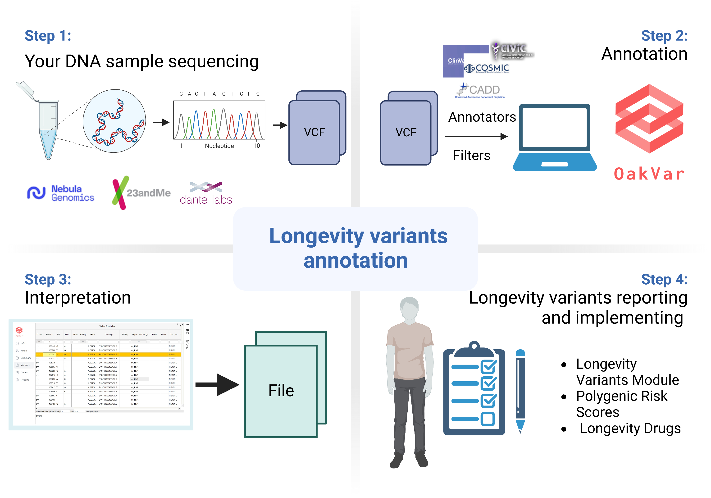

# Just DNA-Seq #

Just DNA-Seq is a set of opensource libraries and pipelines designed to help everybody to:
* realign your genome and do variant calling with the latest tools using [Bioinformatic pipelines](https://github.com/dna-seq/dna-seq)
* annotate your own genome with: 
  * known longevity and cancer risk variations with [longevity OakVar plugin](https://github.com/dna-seq/opencravat-longevity)
  * known [drug interactions](https://github.com/dna-seq/gero-drugs-module)
* get transparent opensource polygenic health risk predictions

## Why Just DNA-Seq? ##

First human genome sequencing happened two decades ago and cost around 3 bln $. 
Today it turned from a great human endeavor to something that is accessible to all of us, and costs roughly 400-800 dollars.

So why bother with the DIY approach when there are a lot of personal genomics services out there already?

For us, the main concerns are the lack of transparency, privacy and, most importantly, room for customization - content of reports is decided by service, your choice is limited with their product line. Results such services deliver are based on proprietary databases and algorithms. While having large analysis departments and a lot of medical data to base conclusions upon, their analysis is not transparent at all, in many cases you have no idea why they made this or that prediction. Verifying or comparing their results is therefore troublesome, especially when you get totally different predictions from many companies.
More to that, what if we want to see how well our genes align with the prospect of longevity? For example, it is known that surviving until 90 years is more about lifestyle choices while living longer depends more on the genetics, people with exceptional longevity are not distinct in terms of lifestyle factors from the general population [[PMID: 21812767](https://doi.org/10.1111/j.1532-5415.2011.03498.x)]. Unfortunately, there are simply no commercial offerings to address that demand.

At the same time, all the information necessary to do your own analysis is out there, lying in the open generously shared by the scientific community. 
So, why not use existing open source solutions developed by large academic groups then? 
Well, no luck here either! 

We looked through the existing ones and found out there are no tools to cover one topic very close to our hearts: genetics of longevity. 

That’s when DNA-Seq comes into play!

## How it works ##

The platform consists of  OakVar (open-source Genomic Variant Analysis Platform) modules, bioinformatics pipelines, and additional libraries. The users can upload their genomes to retrieve  information about their longevity-associated variants, polygenic risk scores (PRS) and variants associated with age-related diseases or major life threatening risks. .

Longevity variants report is based on 1900 variants from LongevityMap and other datasources which are scored and prioritized according to multiple criteria. It also depends on ClinGene, dbSNP and ClinVar modules.

Longevity PRS report is primary based on existing longevity polygenic scores. At the moment our best performing PRS is implemented based on PMC8087277and comprises 330 variants. This PRS was shown to be significantly associated with cognitively healthy aging and with prolonged survival. TIt is not enough to have "centenarian" genes to become one, it is needed to cut down major health risks to gain longevity escape velocity. Hereditary Cancers are caused by a genetic defect that determine a higher-than-normal risk of developing cancer. Report includes about  300 genes, related to cancer predisposition,  progression and tumor cell motility.

Plenty of drugs are frequently prescribed at an elder age, moreover, some drugs are known to have geroprotective action (e.g. statins, metformin, rapamycin, etc.). Drug metabolism to a large extent depends on a person’s genetic polymorphisms, affecting the activity of xenobiotics-transforming enzymes. So it’s a common situation when individual dose correction is needed, or even another drug has to be taken in order to avoid adverse effects. Longevity-drugs report is mostly based on data from PharmGKB database (https://www.pharmgkb.org/) and DrugAge.

It is not enough to have "centenarian" genes to become one, it is needed to cut down major health risks to gain longevity escape velocity. Hereditary Cancers are caused by a genetic defect that determine a higher-than-normal risk of developing cancer. Report includes about  300 genes, related to cancer predisposition,  progression and tumor cell motility.

### Our team: ###

[@antonkulaga](http://github.com/antonkulaga) - bioinformatician at [Systems Biology of Aging Group](http://aging-research.group) and [CellFabrik](http://cellfabrik.bio)

[@winternewt](http://github.com/winternewt) - software developer with a chemical background, bioinformatic pipelines developer

[@OlgaBorysova](http://github.com/OlgaBorysova) - biologist, geneticist, mitochondria expert, and founder of [MitoSpace](http://www.mt-eva.space/en/)

[@Alex-Karmazin](http://github.com/Alex-Karmazin) -  senior computer vision engineer, web developer

[@fkbyf14](http://github.com/fkbyf14)  - bioinformatician

### [Our twitter](https://twitter.com/just_dna_seq) ###
### [Our github](https://github.com/dna-seq/) ###
### [Your YouTube channel](https://www.youtube.com/channel/UCKJPXRJgi4Rxh9Lb1G_9SZw/) ###
### [Our gitcoin](https://gitcoin.co/grants/4048/just-dna-seq) ###
### [Our workshops](https://dna-seq.github.io/dna-seq/workshop/)
